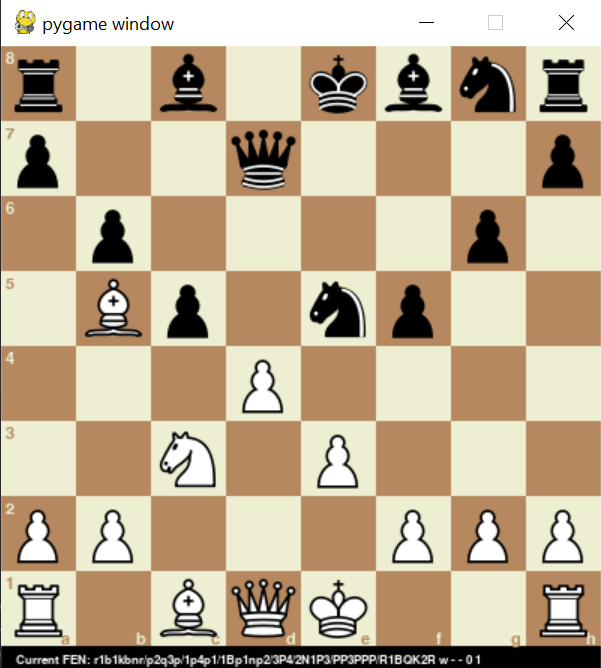

# Chess-Engine
A chess game with GUI using with computer moves generated by [stockfish chess engine](https://stockfishchess.org/)

-----

### Required Libraries

pygame: `pip install pygame`

----

### Feaures to be added:
- [x] Check(mate) indicator
- [x] display current 'FEN' code on the screen
- [ ] View pieces that have been taken
- [ ] Homepage --> maybe change settings
- [ ] A responsive resizable game window
- [ ] Play against another person (definitely local + maybe online)
- [ ] View certainty of a win / draw / loss from the computer
- [ ] Have the option to load the engine locally, instead of using api
- [ ] Levels of difficulty

### Issues:
[See issues section](https://github.com/Ollie-Edwards/Chess-Engine/issues)
